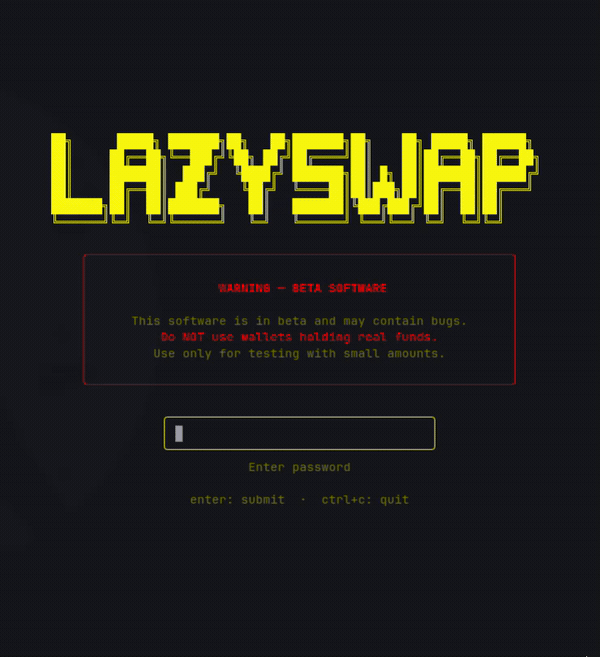

# lazyswap

[](https://github.com/FernandoPazCavalcante/lazyswap/actions/workflows/release.yml)
[](go.mod)
[](LICENSE)

A Vim-style terminal wallet — a **TUI and a CLI** — that swaps crypto
**directly on-chain**, from your machine. Drive it interactively or script it
from the command line. No exchange account, no deposits, no custodian. You hold
the keys; the trade goes straight to a DEX.

Runs on EVM chains (Ethereum, BSC) for on-chain DEX swaps (Uniswap V2 /
PancakeSwap), plus cross-chain BTC swaps via THORchain.

## Highlights

- **Cross-chain BTC swaps.** Swap native Bitcoin ↔ EVM tokens from a single
  terminal wallet, routed through THORchain — no bridge, no wrapped BTC.
- **Self-custody, no exchange.** You hold the keys; trades go straight to a DEX.
  No account, no KYC, no deposits, no withdrawal queue.
- **Encrypted on disk.** Your private key is sealed with AES-256-GCM under a
  PBKDF2-derived key (100k iterations) and never stored or logged in plaintext.
- **Vim-style TUI + scriptable CLI.** A fast, keyboard-driven terminal UI, plus
  a non-interactive CLI for one-shot swaps in scripts and pipelines.
- **Multi-chain EVM.** Ethereum and BSC today, with chain config in one place —
  RPC URLs, routers and token addresses are never hardcoded elsewhere.

## Usage

Launch the TUI, or drive everything from the command line.



```bash
lazyswap                          # launch the Vim-style TUI (first run creates a wallet)

lazyswap swap 0.50 BNB USDT       # swap $0.50 worth of BNB into USDT
lazyswap swap 5 BNB USDT --yes    # skip the y/N confirmation (handy in scripts)
lazyswap wallets                  # list wallet addresses
lazyswap config show              # print current chain / slippage / default wallet
lazyswap help                     # full command reference
```

Set `LAZYSWAP_PASSWORD` to skip the interactive password prompt when scripting.

## Installation

```bash
go install github.com/FernandoPazCavalcante/lazyswap@latest
```

Needs **Go 1.26+** (and a C toolchain — the SQLite driver is cgo-free, but
go-ethereum pulls in cgo on some platforms).

> **Pre-release:** no stable version is tagged yet, so `@latest` tracks the
> `v0.0.0` development tag. For the newest code, use `@master` or
> [build from source](#build-from-source).

Once installed, run `lazyswap` (if `$GOBIN` is on your `PATH`). Data lives in
`~/.lazyswap/` (`wallets.db`, `lazyswap.log`); override with `LAZYSWAP_DATA_DIR`.
First launch creates a wallet; your private key is encrypted with AES-256-GCM
under a PBKDF2-derived key (100k iterations) and never leaves the box in
plaintext.

## Why local beats a centralized exchange

Running lazyswap on your own machine is strictly safer than trading on a CEX:

- **You keep custody.** Keys are encrypted on disk under your password. On a CEX
  the exchange holds your coins — "not your keys, not your coins." Exchanges get
  hacked, freeze withdrawals, and go insolvent (Mt. Gox, FTX). Here the funds are
  in *your* wallet the whole time.
- **No deposit, no withdrawal queue.** The swap executes against the DEX router
  from your address in one signed transaction. Nothing to deposit first, nothing
  to wait to withdraw.
- **No account, no KYC, no gatekeeper.** No sign-up, no identity upload, no
  region lock, no account suspension. Just a wallet and an RPC.
- **The key never leaves your machine.** RPC reads, quotes, and signing all happen
  locally. Your password and private key are never transmitted to a server.
- **On-chain transparency.** Every trade is a public transaction you can verify on
  a block explorer — not an internal ledger entry you have to trust.

Trade-off: you pay network gas and you are responsible for your own backup. Lose
the password and the encrypted key with no seed backup, and it's gone — same rule
as any self-custody wallet.

## Architecture

```
                          ┌──────────────┐
                          │   main.go    │  open DAO, build TUI, run
                          └──────┬───────┘
                                 │
                     ┌───────────▼────────────┐
                     │  TUI  (Bubble Tea)      │  internal/tui
                     │  screens · panels ·     │  login, mainscreen,
                     │  overlays · theme · keys│  swap/import overlays
                     └───────────┬────────────┘
                                 │ calls
              ┌──────────────────┼──────────────────────┐
              │                  │                       │
       ┌──────▼──────┐    ┌──────▼───────┐        ┌──────▼───────┐
       │   wallet    │    │     swap     │        │   balance    │
       │ CRUD + DAO  │    │ orchestration│        │  fetch/format│
       └──────┬──────┘    └──────┬───────┘        └──────┬───────┘
              │                  │                       │
      ┌───────▼───────┐   ┌──────▼──────┬─────────┐      │
      │    crypto     │   │     dex     │ thorchain│      │
      │ AES-256-GCM   │   │ Uniswap V2 /│ cross-   │      │
      │ + PBKDF2      │   │ PancakeSwap │ chain BTC│      │
      └───────┬───────┘   └──────┬──────┴────┬─────┘      │
              │                  │           │            │
       ┌──────▼──────┐    ┌──────▼───────────▼────────────▼──────┐
       │  SQLite DAO │    │     chain config  ·  explorer API    │
       │ wallets.db  │    │  RPC URLs, routers, token addresses  │
       └─────────────┘    └──────────────────────────────────────┘
                                       │
                                ┌──────▼──────┐
                                │  EVM RPC /  │  on-chain
                                │ DEX router  │  (your signed tx)
                                └─────────────┘
```

Layers: **TUI → Services → DAO / Blockchain**. `internal/chain/config.go` is the
single source of truth for RPC URLs, router and token addresses — nothing
chain-specific is hardcoded elsewhere. `internal/paths` owns filesystem
locations; `internal/applog` writes to `lazyswap.log` (never stdout).

## Build from source

```bash
git clone https://github.com/FernandoPazCavalcante/lazyswap.git
cd lazyswap
go build -o lazyswap .   # produces ./lazyswap
go run .                 # or run straight from source, no binary
go test ./...            # run the test suite
```

## Contributing

Found a bug or want a feature? [Open an issue](https://github.com/FernandoPazCavalcante/lazyswap/issues).
Pull requests are welcome — the project follows
[Conventional Commits](https://www.conventionalcommits.org/) (semantic-release
drives versioning off the commit history).

## Author

Built by **Fernando Paz Cavalcante** ([@FernandoPazCavalcante](https://github.com/FernandoPazCavalcante)).

## License

[MIT](LICENSE)
